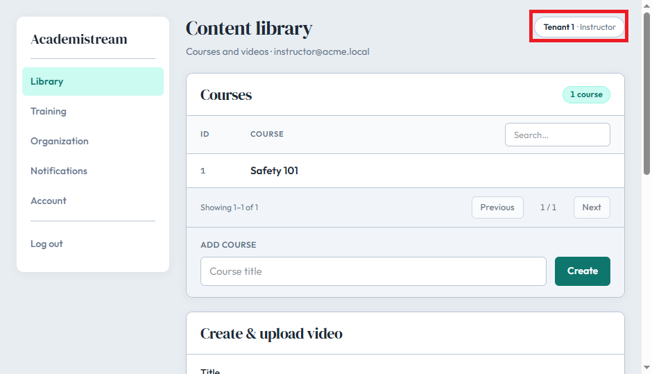
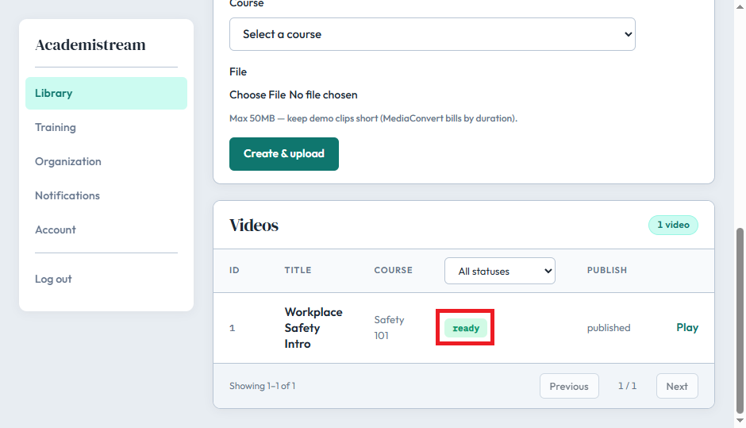
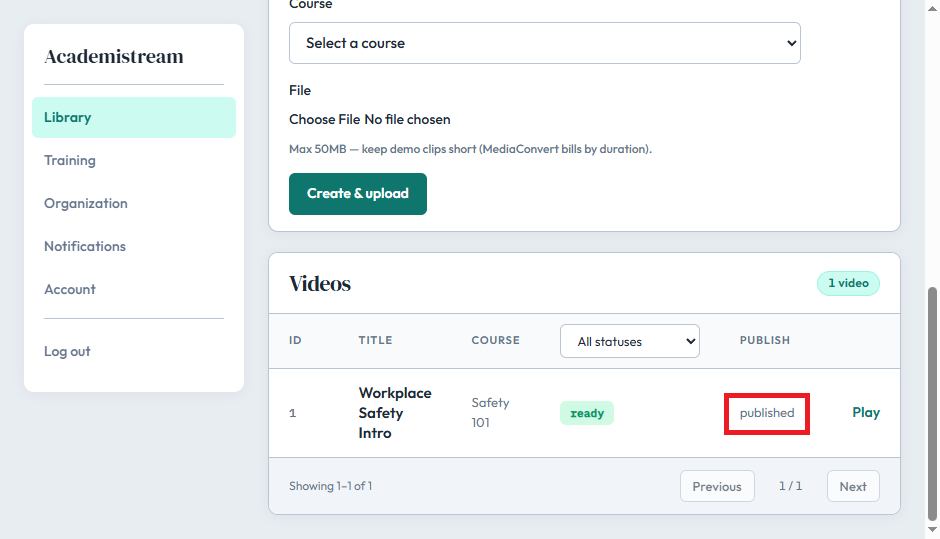
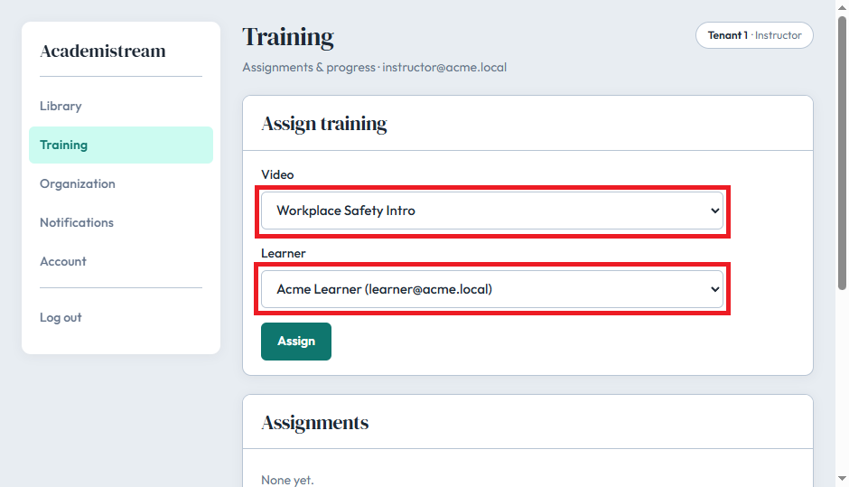
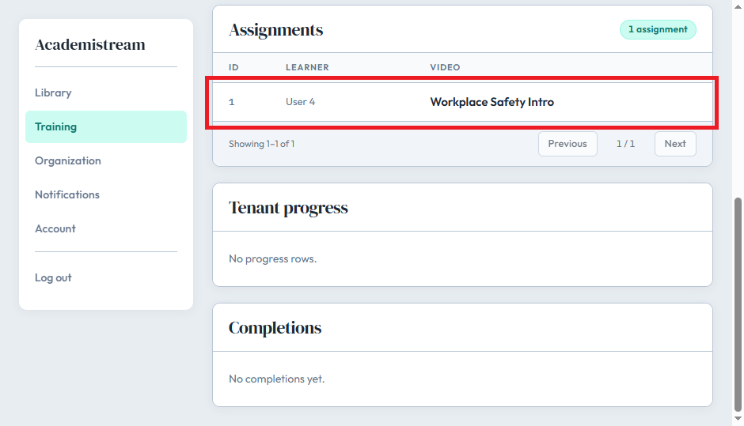
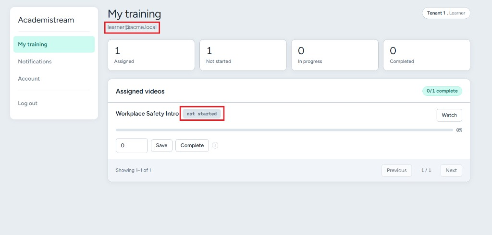
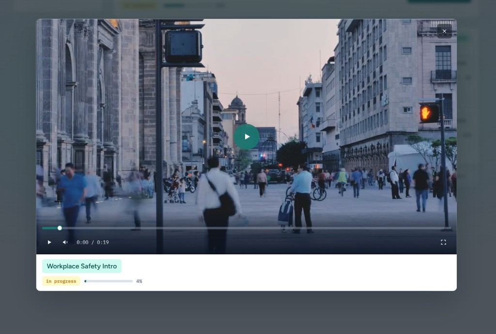
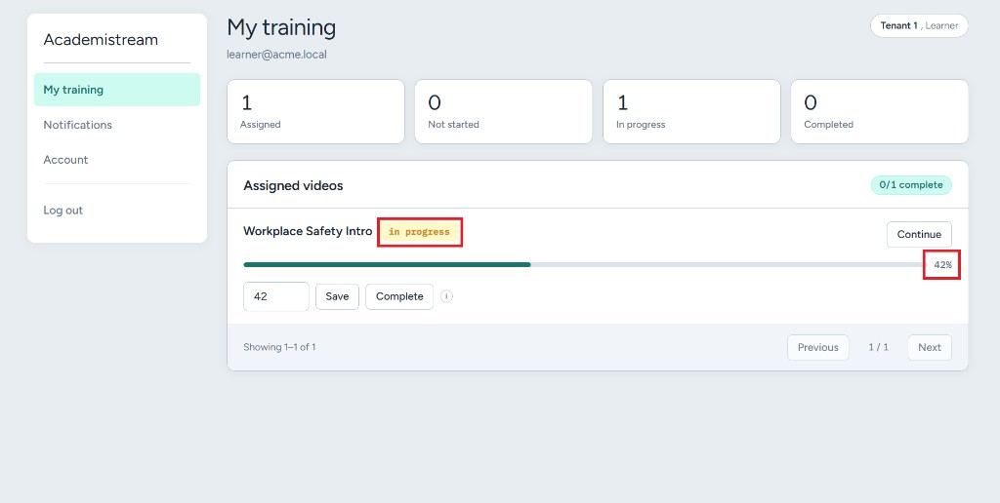

# Product tour

Marked screenshots of the hosted demo flows (no docs/closer slide).

## Instructor flow

Staff create courses, upload video, publish, and assign training to a learner.

### Library

Tenant context and the content library home (courses + create/upload).

### Media ready

After upload/processing, the video shows **ready** in the library table.

### Published

Staff set visibility to **published** so learners can be assigned the video.

### Assign training

Pick a published ready video and a learner, then assign.

### Assigned

The assignment appears in the staff Training view.

## Learner flow

Learners see assigned videos, watch, and track progress.

### My training

Assigned list for the learner — starting state (**not started**).

### Watch

In-app player modal for the assigned video (no callout marks on this shot).

### In progress

Progress reflected on the list (**in progress**, ~42%).

